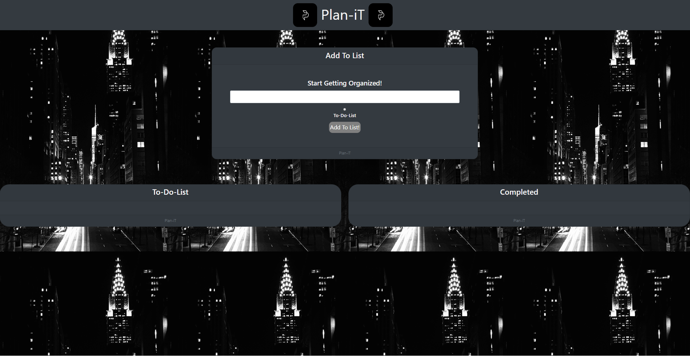
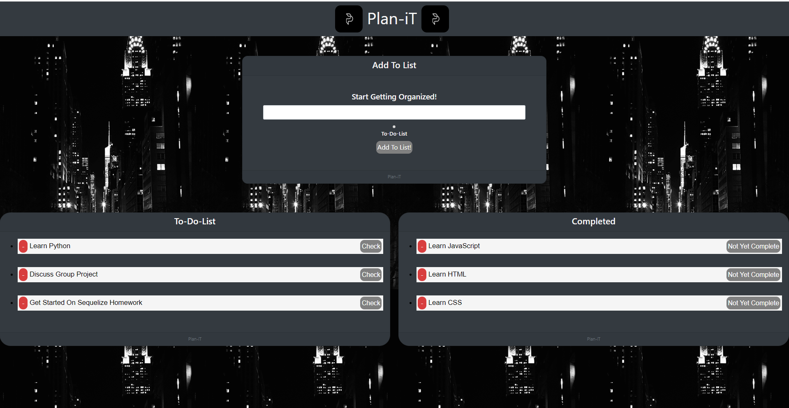

# Plan-iT

* Do you ever lose track of what you are supposed to do for the day? <br> <br>
* Are you stressed out because you have too much tasks to complete and you feel unorganized? <br> <br>
Not To Worry! <br><hr>

## Plan-iT : <br>

<br>

### A task organizer to keep track of your agendas/chores using MySQL database, Express, and Express-HandleBars. 


<hr><br>
 Links :  

Deployed Website: <br>
https://planit-bryanjacinto.herokuapp.com/
<br>

Github: <br>
https://github.com/bryanjacinto1994/Plan-iT


<hr>

### Screenshots: <br>

* Home page: <br> This below is an empty organizer. Type in your agenda for the day and click on the radio button and submit. Once you have clicked submit, your typed agenda will be appended to the "To-Do-List" section which will be shown the screenshot below this screenshot. <br><br>
 <br> <br><hr>

* To-Do-List: <br><br> As mentioned above, all typed and submitted agenda will be appended to the To-Do-List section. <br><br> Example below: <br><br>
 <br>  <br>

* Completed: <br><br> Once you have completed some of the tasks you need to take care off, click on the "Check" button. Click that button will append that specific task onto the "Completed" Section. And once it is appended, you may delete it by clicking on the red button. <br><br>
Although, if you find yourself wanting to go back to that task because maybe... you weren't fully finished, you make click the "Not Yet Complete" button so it will append back to the To-Do-List.<br><br>
 <br> <br> 

<hr>


## Tools Used:

* Visual Studio Code - Open source code editor for building and debugging web and cloud applications.
* JavaScript - A scripting language that uses curly-bracket syntax, first class functions and object-oriented.
* jQuery - A JavaScript library that simplifys to manipulate HTML DOM.
* Git - Version control system to track changes to source code.
* Github - Hosts respository that can be deployed to GitHub pages.
* NodeJS - A JavaScript runtime built on Chrome's V8 JavaScript engine
* MySQL - Open-source relational database management system.
* MVC Method - Model, View and Controller
<br>

### NPM Packages Used:

* Express
* Express-handlebars
* MySQL

### ====== Installation guide for the NPM packages are located below ======


<hr>

## Get Started :
* Run Terminal/Git Bash.
* Do an npm install on these following packages:<br>

#### * npm install express
#### * npm install express-handlebars
#### * npm install mysql
 


* Go into the files where the server.js file is located. <br>
Run on the Terminal / Gitbash<br>
### node server.js:
Once this command is run, "node server.js", the listener will make a PORT to local host: 8080. Then on the web browser, the screenshots above should display the page on the screen.

<hr>

## Summary

Plan-iT is a tasks/planner list to keep track of your agendas for the day. Type in your agenda on the search bar, click on the radio button, then click the submit button. Once the button has been submited, the typed agenda will be appended to the "To-Do-List" section.<br><br> Once you are done with your tasks, click on the "Check" button to check off what you have completed. Your completed tasks will be then appended to the Completed section. <br><br> If you find yourself thinking about the tasks you have just completed but feel like you did not, you may click on the "Not Yet Complete" so that specific task will be appended back to your "To-Do-List" Section.


<hr>


## Code Snippet

planners_controller.js : <br>

*  This code snippet below shows the express function. This will make add a new task/agenda to the list.
<br> 

```javascript

router.put('/api/planners/:id', function(req, res){
    var condition = 'id = ' + req.params.id;

    console.log('condition', condition);

    planner.updateOne({
        completed: req.body.completed
    }, condition, function(result){
        if(result.changedRows == 0){
            return res.status(404).end();
        }
        else{
            res.status(200).end();
        }
    });    
});
```
<hr>
planners_controller.js: <br>

* This code snippet below shows a function that will delete a task list.
<br>

```javascript
router.delete('/api/planners/:id', function(req, res){
    var condition = 'id = ' + req.params.id;

    planner.deleteOne(condition, function(result){
        if(result.affectedRows == 0){
            return res.status(404).end();
        }
        else{
            res.status(200).end();
        }
    });
});
```

## Author Links
Linkedin:<br>
https://www.linkedin.com/in/bryan-jacinto-100438aa/

Github:<br>
https://github.com/bryanjacinto1994
<br>


<hr>
